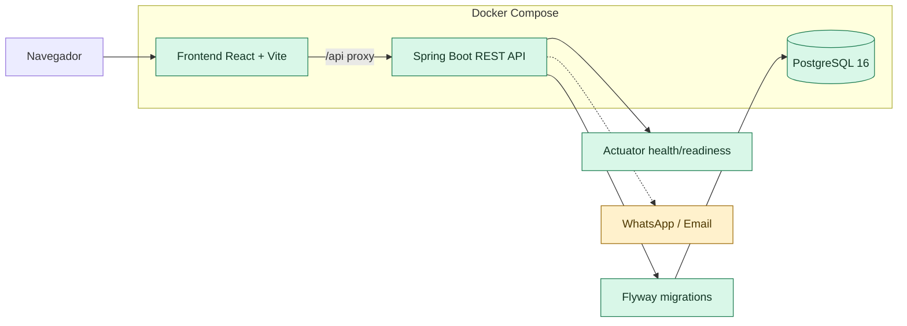
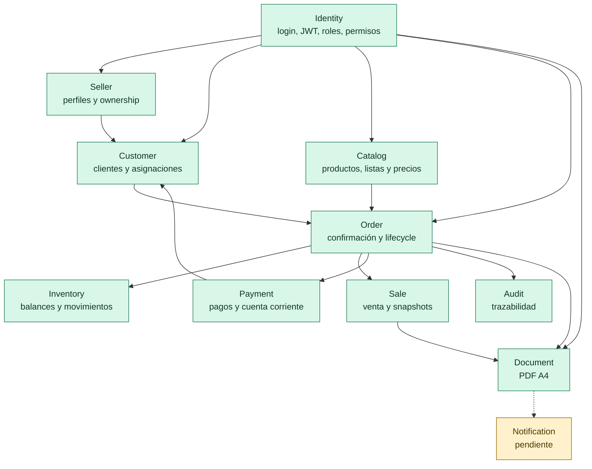
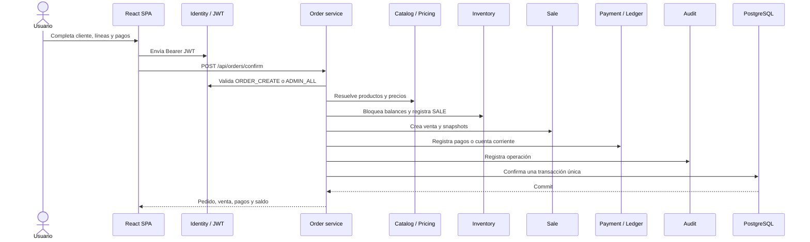
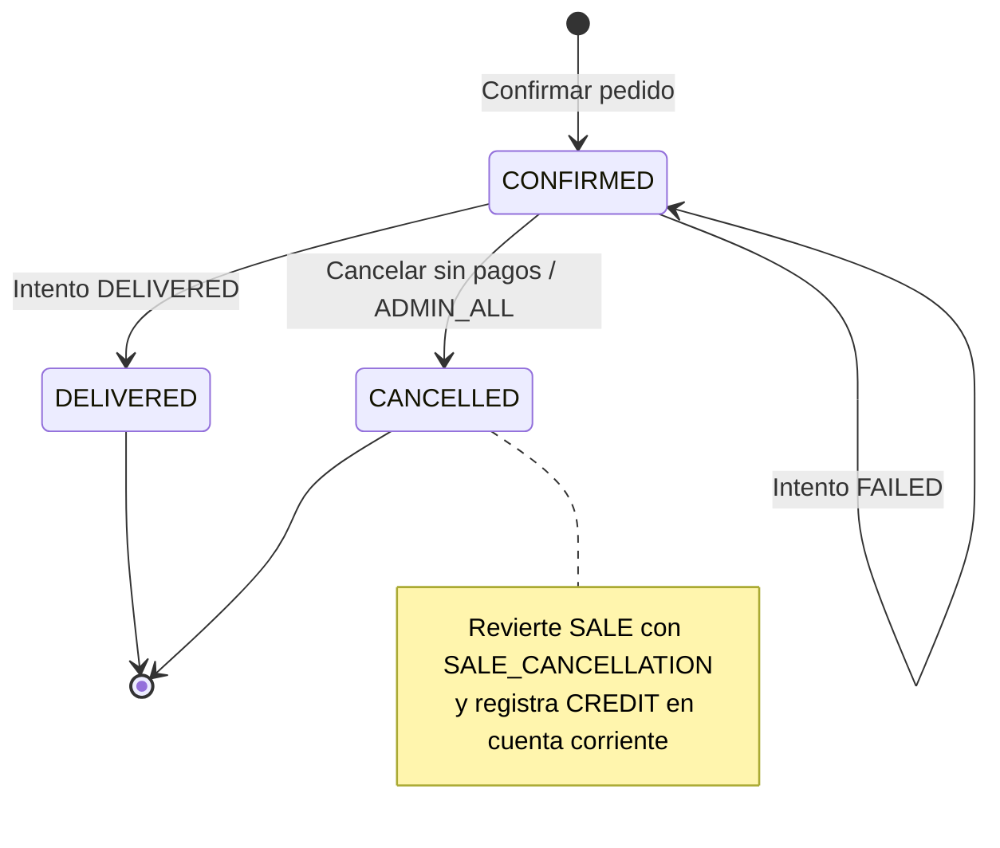
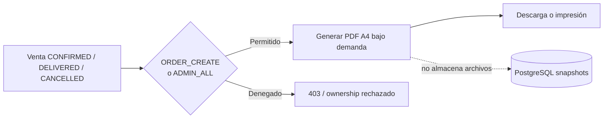
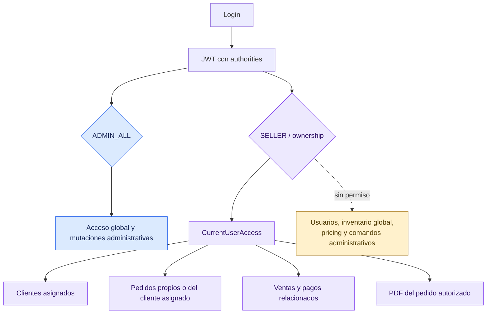
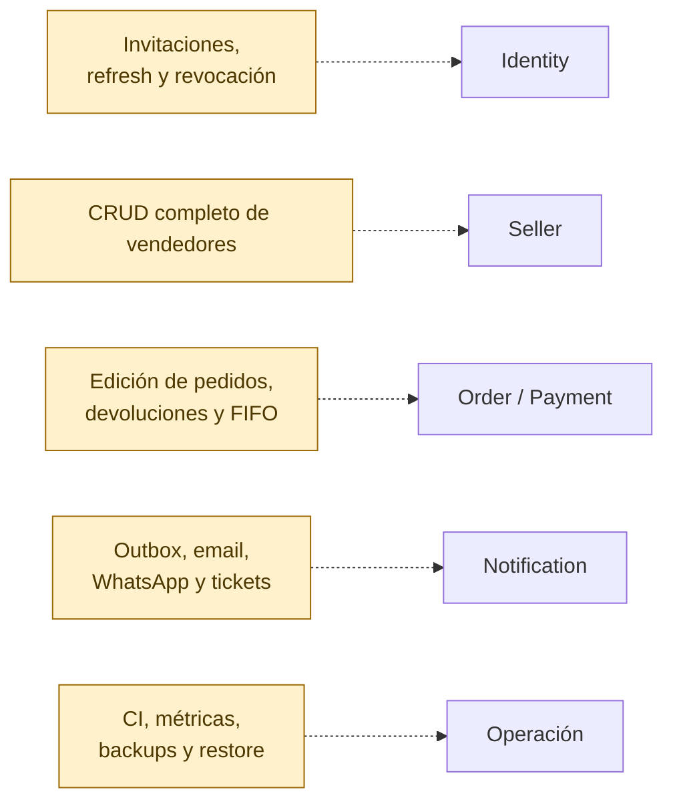

# Estado Actual Del Programa

Estado relevado: 2026-09-20.

Este documento usa Mermaid para mostrar cómo quedó el sistema después de los
bloques implementados. Las líneas punteadas representan capacidades previstas
pero todavía no implementadas.

## Despliegue

## Módulos Implementados

## Confirmación Y Venta

## Lifecycle Y Documentos

## Autorización Y Ownership

## Pendiente

## Leyenda

- Verde: implementado y probado.
- Azul: acceso administrativo global.
- Violeta: ownership seller.
- Amarillo: pendiente o previsto.
- Flecha continua: dependencia o flujo implementado.
- Flecha punteada: integración o funcionalidad pendiente.
