# Diagramas del frontend

## Propósito

Este documento reúne los diagramas técnicos y funcionales del frontend. Sirve
como referencia para desarrollar nuevas features sin mezclar server state,
form state, URL state, sesión y estado visual.

La implementación debe respetar también:

- [`frontend-architecture.md`](./frontend-architecture.md)
- [`module-boundaries.md`](./module-boundaries.md)
- [`api-guidelines.md`](../api/api-guidelines.md)
- [`functionalities.md`](../domain/functionalities.md)

## 1. Arquitectura técnica

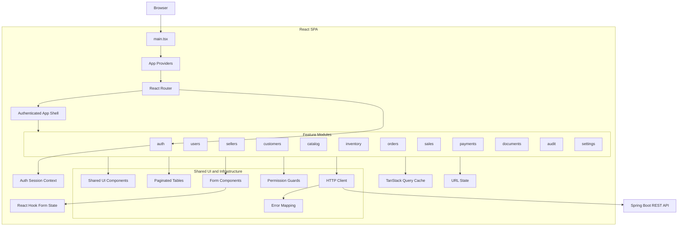

## 2. Dependencias internas

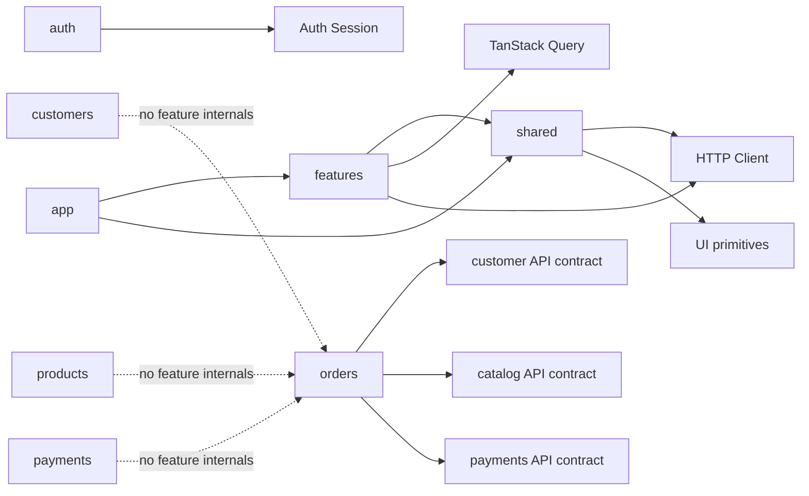

Reglas:

- `app` configura la aplicación, pero no contiene reglas comerciales.
- Una feature puede consumir contratos públicos de otra feature, no sus
  componentes, hooks o repositories internos.
- `shared` no puede importar una feature concreta.
- El cliente HTTP es el único lugar para headers, JWT, errores y correlation ID.
- TanStack Query administra datos del backend; no se replica todo en un store.

## 3. Navegación y rutas

```mermaid
flowchart TD
    Root[/]

    Root --> Public[Public Layout]
    Public --> Login[/login]
    Public --> Activate[/activate]
    Public --> Recover[/password-recovery]
    Public --> Reset[/password-reset]

    Root --> Protected{Authenticated Route}
    Protected --> AppShell[App Shell]

    AppShell --> Orders[/orders]
    AppShell --> OrderCreate[/orders/new]
    AppShell --> OrderDetail[/orders/:orderId]
    AppShell --> Sales[/sales]
    AppShell --> SaleDetail[/sales/:saleId]
    AppShell --> Customers[/customers]
    AppShell --> CustomerDetail[/customers/:customerId]
    AppShell --> CustomerAccount[/customers/:customerId/account]
    AppShell --> Products[/products]
    AppShell --> ProductDetail[/products/:productId]
    AppShell --> PriceLists[/price-lists]
    AppShell --> Inventory[/inventory]
    AppShell --> Movements[/inventory/movements]

    AppShell --> Admin[Admin Area]
    Admin --> Users[/admin/users]
    Admin --> Sellers[/admin/sellers]
    Admin --> Roles[/admin/roles]
    Admin --> Audit[/admin/audit]
    Admin --> Settings[/admin/settings]

    AppShell --> Unauthorized[/403]
    Root --> NotFound[/404]
```

Reglas:

- Rutas públicas no requieren sesión.
- Rutas protegidas requieren access token válido.
- La renovación fallida de sesión devuelve al usuario a `/login`.
- El acceso sin permiso muestra `/403`.
- Filtros, búsqueda, orden y paginación viven en query params.
- `/orders/new` mantiene el formulario local y no crea un borrador backend.

## 4. Estado de la aplicación

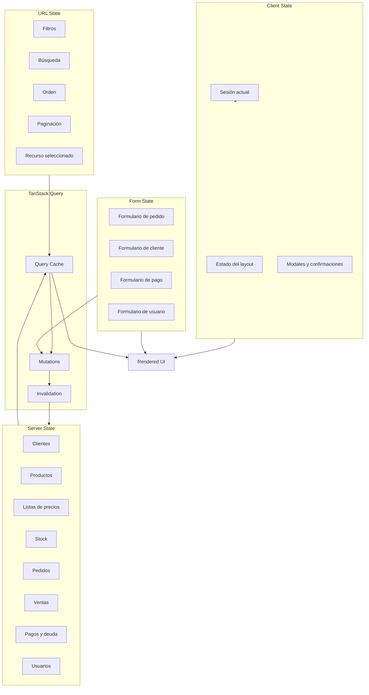

| Estado | Responsable | Ejemplos |
|---|---|---|
| Server state | TanStack Query | productos, stock, pedidos, deuda |
| Form state | React Hook Form | pedido, cliente, usuario, pago |
| URL state | React Router | filtros, página, orden, búsqueda |
| Auth state | Auth context | usuario actual y sesión |
| UI state | estado local | sidebar, modal, confirmación |

No se debe guardar una copia global completa de productos, clientes, pedidos o
ventas.

## 5. Activación y login

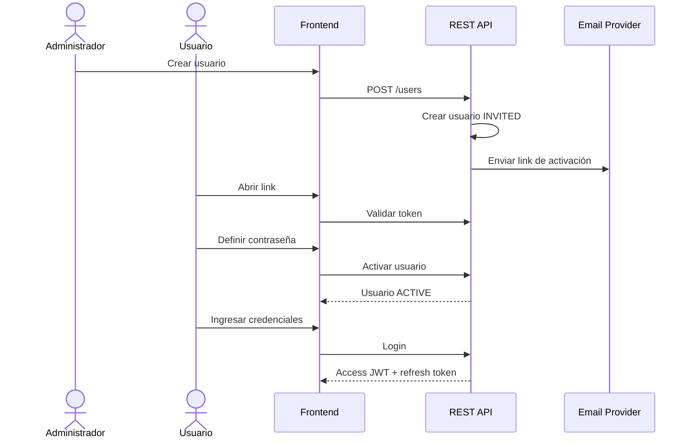

Estados visuales relevantes:

```text
INVITED → ACTIVATING → ACTIVE
ACTIVE → LOCKED
LOCKED → ACTIVE
ACTIVE → INACTIVE
```

El frontend nunca recibe ni muestra contraseñas temporales. La activación usa un
link de un solo uso con expiración.

## 6. Permisos y navegación contextual

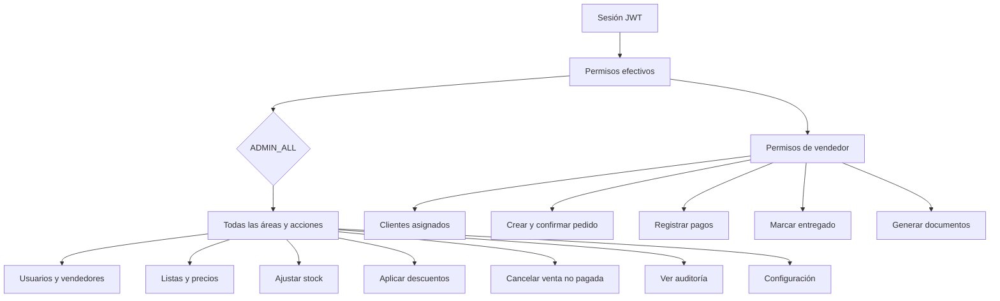

El vendedor no visualiza acciones para modificar pedidos, precios, descuentos,
stock, listas, auditoría o usuarios. El backend siempre vuelve a validar el
permiso.

## 7. Creación y confirmación de pedido

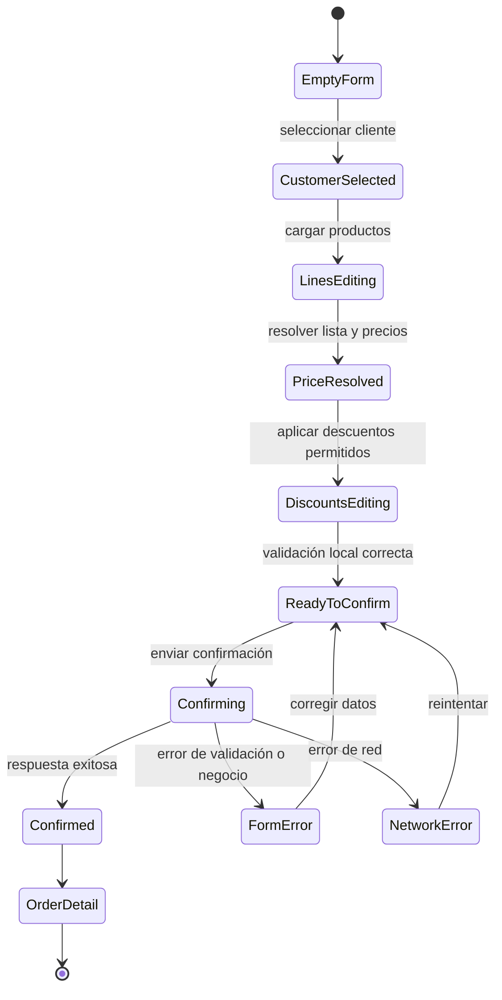

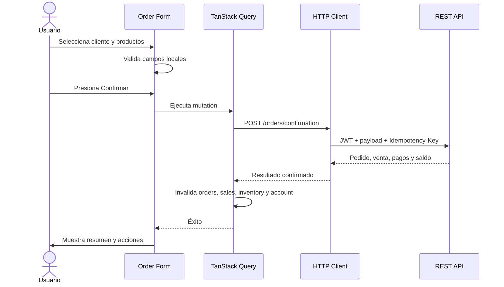

La confirmación no persiste borradores. Si falla, el formulario conserva los
datos locales para permitir reintentar.

## 8. Flujo de pagos y cuenta corriente

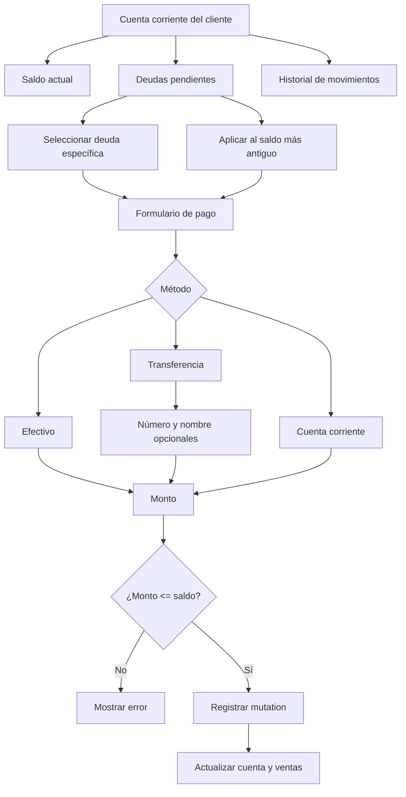

Después de registrar un pago se invalidan las queries de cuenta corriente, deuda,
venta y resumen del cliente.

## 9. Entrega e intentos

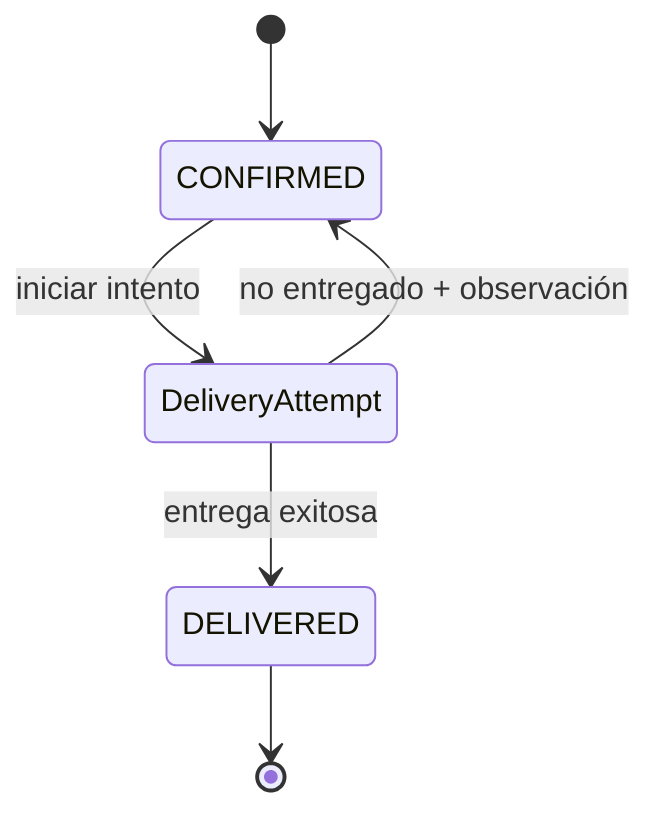

La fecha y hora provienen del backend. La observación es obligatoria cuando el
resultado es no entregado. El intento fallido no cambia el estado principal.

## 10. Documentos, impresión y WhatsApp

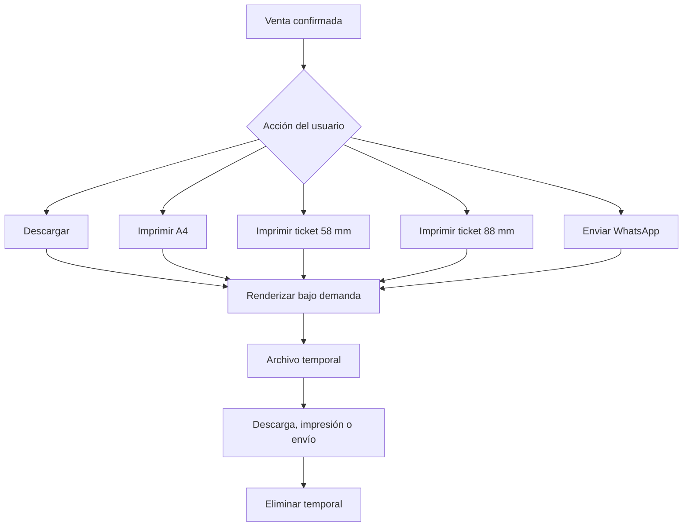

Las acciones documentales no se ejecutan automáticamente al confirmar una
venta. Un error de renderer o WhatsApp no modifica la venta.

## 11. Administración

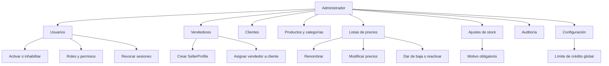

## 12. Estados visuales comunes

Cada pantalla de consulta o mutación debe contemplar:

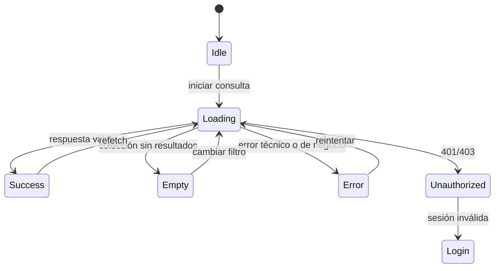

Los errores de validación se muestran junto al campo. Los errores de negocio se
muestran como mensajes accionables y los errores técnicos ofrecen reintento.

## 13. Reglas responsive

- Las tablas deben tener una representación usable en mobile.
- Los formularios de pedido deben priorizar búsqueda y carga de líneas.
- Las acciones irreversibles deben permanecer visibles y confirmables.
- El layout administrativo puede usar sidebar en desktop y drawer en mobile.
- Los filtros deben poder abrirse como panel en pantallas pequeñas.
- Los modales no deben contener workflows largos; usar páginas cuando el flujo
  sea complejo.
