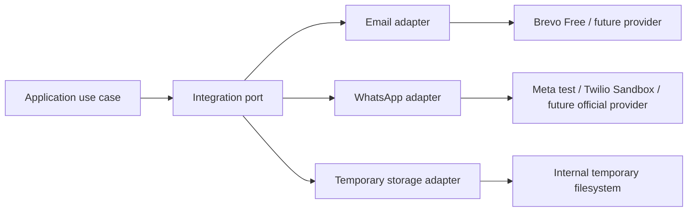

# Arquitectura de integraciones

## Principio

Las integraciones externas se encapsulan mediante ports/adapters. El dominio
no conoce SDKs, URLs, tokens ni modelos de proveedores.



## Email

Uso inicial:

- Activación de usuarios.
- Recuperación de contraseña.
- Alertas operativas.

Proveedor inicial recomendado: Brevo Free. El adapter debe permitir reemplazarlo
sin modificar `identity` ni `audit`.

Requisitos:

- SPF, DKIM y DMARC.
- Templates versionados.
- Estados de envío y errores sanitizados.
- Reintentos controlados.
- No registrar tokens ni contenido sensible en logs.

## WhatsApp

El envío es opcional y manual. La confirmación de una venta no depende de
WhatsApp.

Para desarrollo se puede utilizar Meta Cloud API de prueba o Twilio Sandbox.
La producción requiere una API oficial o BSP oficial. No se usarán
automatizaciones de WhatsApp Web.

El flujo es:

```text
Usuario solicita envío
→ generar documento temporal
→ crear delivery request
→ enviar mediante adapter
→ actualizar estado y respuesta
→ eliminar documento temporal
```

Estados externos recomendados:

```text
PENDING
PROCESSING
SENT
FAILED
RETRY_EXHAUSTED
```

Cada envío debe tener idempotency key para evitar duplicados.

## Documentos y almacenamiento

Los documentos se generan bajo demanda para descargar, imprimir o enviar.
Inicialmente se almacenan temporalmente en filesystem interno no público, con
retención recomendada de una hora y limpieza programada.

La persistencia permanente de PDFs no forma parte del alcance inicial. Si se
agrega, se utilizará un adapter compatible con filesystem, MinIO o S3 y
PostgreSQL conservará únicamente metadata.

## Outbox

`notification.outbox_events` guarda el evento `ORDER_CONFIRMED` dentro de la
misma transacción que confirma pedido, venta, stock, pagos, cuenta corriente y
auditoría. La clave `ORDER_CONFIRMED:<orderId>` es única y evita duplicar el
evento al repetir la operación.

El worker toma lotes con `FOR UPDATE SKIP LOCKED`, publica cada evento en el
proceso y persiste `PROCESSED` solo después de que terminen los consumidores
síncronos. Los fallos regresan a `PENDING` con backoff exponencial (30 segundos
iniciales, máximo seis horas); después de ocho intentos pasan a
`RETRY_EXHAUSTED`. Un lease de dos minutos recupera trabajo abandonado si el
proceso se interrumpe.

El despacho es al menos una vez: un consumidor puede recibir el mismo ID de
evento más de una vez si el proceso se interrumpe entre el efecto y el marcado
final. Todo consumidor debe deduplicar por `event.id`. El polling se ejecuta
cada cinco segundos y se configura con `OUTBOX_WORKER_ENABLED` y
`OUTBOX_POLL_INTERVAL_MS`.

La primera emisión integrada es `ORDER_CONFIRMED`; los eventos de documentos,
WhatsApp/email y sus consumidores se incorporarán con sus flujos específicos.

La falla de email, WhatsApp o almacenamiento no revierte la confirmación del
pedido.

## Timeouts y resiliencia

Cada cliente externo debe tener:

- Timeout de conexión.
- Timeout de respuesta.
- Reintentos limitados.
- Backoff.
- Idempotencia.
- Registro de error sin secretos.
- Estado visible para el usuario interno.
