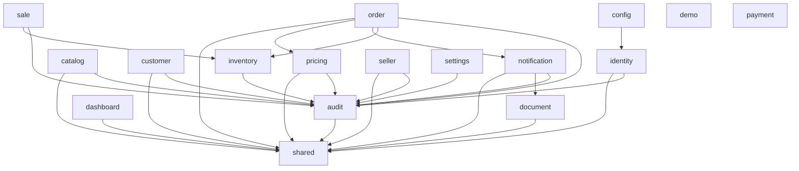

# Límites de módulos

## Reglas generales

- Cada módulo es dueño de su modelo y sus tablas.
- No se comparten entidades JPA.
- No se accede a repositories internos desde otro módulo.
- Las referencias externas se expresan como IDs o contratos públicos.
- Las operaciones síncronas pasan por una facade o caso de uso público.
- Los hechos de negocio se comunican mediante eventos definidos.
- Un módulo no modifica directamente el estado de otro módulo.

## Mapa de responsabilidades

| Módulo | Es dueño de | No debe hacer |
|---|---|---|
| `identity` | usuarios, credenciales, roles, permisos, sesiones | reglas de clientes o ventas |
| `seller` | perfil comercial y estado del vendedor | duplicar usuarios o administrar passwords |
| `customer` | datos del cliente, dirección y asignaciones | calcular stock o guardar pagos |
| `catalog` | productos, marcas, categorías y listas | modificar saldo de inventario |
| `inventory` | depósitos, balances compuestos por depósito/producto y movimientos de stock | conocer entidades internas de pedidos |
| `order` | pedido, líneas y confirmación | escribir tablas internas de stock |
| `sale` | venta derivada, snapshots y estado comercial | crear pedidos independientes |
| `payment` | pagos, ledger y aplicaciones de deuda | modificar ventas sin un caso de uso |
| `document` | modelos y renderers de documentos | decidir reglas comerciales |
| `notification` | email, WhatsApp y estados de entrega externa | confirmar ventas o modificar deuda |
| `audit` | trazabilidad de operaciones | reemplazar logs técnicos |

## Dependencias permitidas

Cada flecha significa que el paquete de origen depende de tipos del paquete de
destino. `config` es cableado de la aplicación fuera de los módulos de negocio.
`demo` no tiene dependencias Java entre módulos; el paquete `payment` todavía
solo contiene `package-info.java`.

## Confirmación de pedido

`order` coordina el caso de uso de confirmación, pero cada módulo conserva la
responsabilidad de validar su propio dominio:

- `catalog` valida productos y precios.
- `customer` valida el cliente.
- `seller` valida el vendedor si existe asignación.
- `inventory` registra movimientos y controla concurrencia.
- `order` elige el depósito al confirmar, conserva su ID y solicita movimientos a
  la fachada pública de `inventory`; no escribe las tablas de inventario.
- `sale` crea la venta y sus snapshots.
- `payment` registra pagos o deuda.
- `audit` registra la operación.

Las transferencias entre depósitos pertenecen a `inventory`: bloquean ambos
saldos en orden determinista y crean las salidas/entradas como una única
operación. `sale` devuelve stock al depósito guardado por la venta; la
cancelación del pedido revierte los movimientos agrupados por depósito y
producto.

## Contratos compartidos

Solo pueden vivir en `shared` tipos verdaderamente transversales, por ejemplo:

- `PageRequest` y `PageResponse`.
- `ProblemDetail`.
- `CorrelationId`.
- Tipos de fecha y reloj.
- Errores técnicos comunes.

No deben ubicarse allí modelos de negocio para evitar un módulo compartido que
se convierta en dependencia global.

## Verificación automática actual

`ModuleBoundaryTest` aplica cuatro reglas ArchUnit de capas: las APIs no acceden a
infraestructura, el dominio no depende de las capas de entrega, `shared` no
depende de `catalog` y `application` no depende de DTOs de `api`. También exige
que los slices de módulos estén libres de ciclos. El importador apunta al
directorio de clases de producción para excluir tests y artefactos viejos de
`target`; en total se verifican cinco reglas.

La dependencia que cerraba el ciclo anterior `audit → shared → catalog → audit`
se rompió eliminando `shared → catalog`: el manejo de
`ProductPriceValidationException` vive ahora en
`catalog.api.CatalogExceptionHandler`. La regla ArchUnit evita que esa arista
reaparezca.

Los servicios de aplicación ya no importan DTOs de transporte. Cada módulo
define contratos de comando y resultados de aplicación; sus controladores
adaptan esos tipos a los DTOs HTTP. `applicationDoesNotDependOnApi` protege la
dirección de dependencias.

Esto elimina el ciclo conocido `audit → shared → catalog → audit` y la deuda
de `application → api` identificada en esa revisión.

### Revisión del grafo intermodular (2026-09-24)

La primera ejecución global enumeró ciclos nuevos. El grupo de identidad se
resolvió trasladando `JwtService` y `JwtAuthenticationFilter` a
`identity.security`, el cableado `SecurityConfig` a `config`, y los mapeos de
refresh/activación a `identity.api.IdentityExceptionHandler`. Así `shared` deja
de depender de identidad.

El handler de errores de documentos se trasladó a
`document.api.DocumentExceptionHandler`; `shared` ya no depende de `document`.
Sus dos respuestas (404 de documento inexistente y 409 cuando falta la venta)
se conservan y los tests HTTP de `DocumentController` pasan.

El último grupo de ocho caminos se resolvió trasladando el manejo de
`IdempotencyConflictException` a `order.api.OrderExceptionHandler`. Los errores
específicos de identidad, documentos, pedidos y catálogo se manejan en su
módulo; `shared.error.ApiExceptionHandler` conserva solo errores transversales.

La regla ArchUnit global ahora pasa: el grafo de dependencias Java entre todos
los slices de producción está libre de ciclos. El grafo de arriba refleja las
aristas observadas en el código actual; la prueba evita que se agreguen ciclos
sin revisión.
