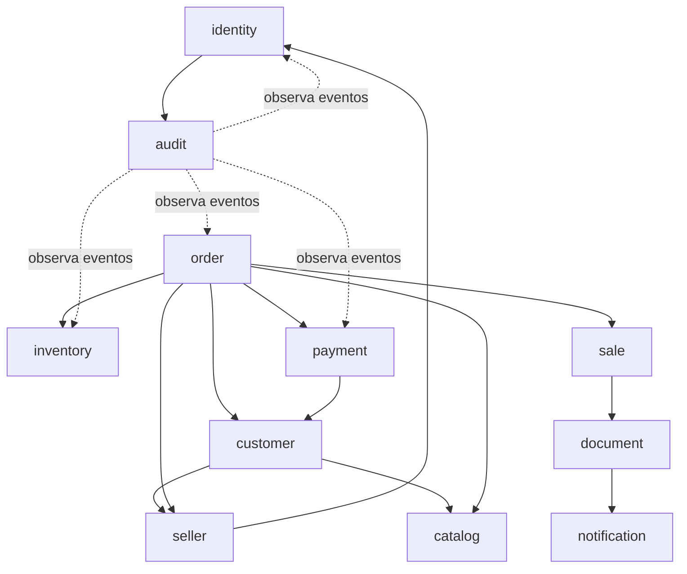

# Límites de módulos

## Reglas generales

- Cada módulo es dueño de su modelo y sus tablas.
- No se comparten entidades JPA.
- No se accede a repositories internos desde otro módulo.
- Las referencias externas se expresan como IDs o contratos públicos.
- Las operaciones síncronas pasan por una facade o caso de uso público.
- Los hechos de negocio se comunican mediante eventos definidos.
- Un módulo no modifica directamente el estado de otro módulo.

## Mapa de responsabilidades

| Módulo | Es dueño de | No debe hacer |
|---|---|---|
| `identity` | usuarios, credenciales, roles, permisos, sesiones | reglas de clientes o ventas |
| `seller` | perfil comercial y estado del vendedor | duplicar usuarios o administrar passwords |
| `customer` | datos del cliente, dirección y asignaciones | calcular stock o guardar pagos |
| `catalog` | productos, marcas, categorías y listas | modificar saldo de inventario |
| `inventory` | balances y movimientos de stock | conocer entidades internas de pedidos |
| `order` | pedido, líneas y confirmación | escribir tablas internas de stock |
| `sale` | venta derivada, snapshots y estado comercial | crear pedidos independientes |
| `payment` | pagos, ledger y aplicaciones de deuda | modificar ventas sin un caso de uso |
| `document` | modelos y renderers de documentos | decidir reglas comerciales |
| `notification` | email, WhatsApp y estados de entrega externa | confirmar ventas o modificar deuda |
| `audit` | trazabilidad de operaciones | reemplazar logs técnicos |

## Dependencias permitidas

El gráfico representa dependencias de contratos, no acceso directo a tablas.

## Confirmación de pedido

`order` coordina el caso de uso de confirmación, pero cada módulo conserva la
responsabilidad de validar su propio dominio:

- `catalog` valida productos y precios.
- `customer` valida el cliente.
- `seller` valida el vendedor si existe asignación.
- `inventory` registra movimientos y controla concurrencia.
- `sale` crea la venta y sus snapshots.
- `payment` registra pagos o deuda.
- `audit` registra la operación.

## Contratos compartidos

Solo pueden vivir en `shared` tipos verdaderamente transversales, por ejemplo:

- `PageRequest` y `PageResponse`.
- `ProblemDetail`.
- `CorrelationId`.
- Tipos de fecha y reloj.
- Errores técnicos comunes.

No deben ubicarse allí modelos de negocio para evitar un módulo compartido que
se convierta en dependencia global.
