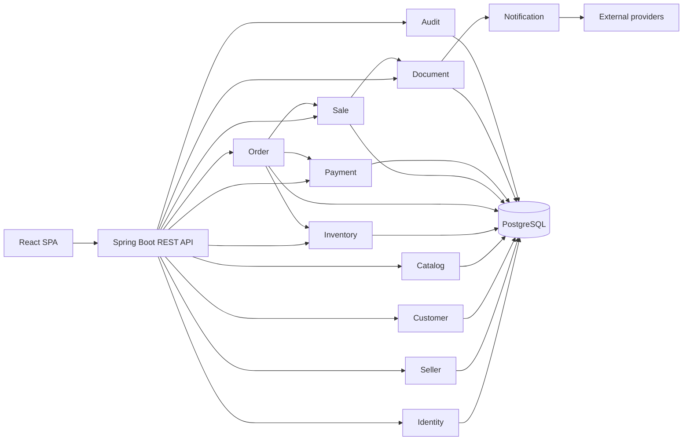
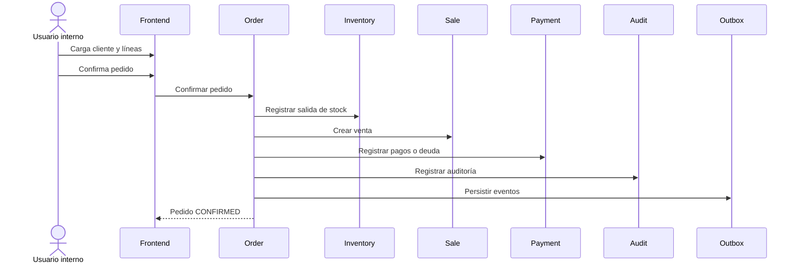

# Arquitectura general

## Propósito

Este documento presenta la arquitectura global del sistema y sus criterios de
evolución. La aplicación se despliega para una empresa por instancia y está
compuesta por una API REST en Spring Boot y una SPA React independiente.

## Decisión principal

El sistema utiliza un **monolito modular**. Todos los módulos se ejecutan en el
mismo proceso y comparten una base PostgreSQL, pero cada módulo mantiene la
responsabilidad de su dominio, sus casos de uso y sus datos.

## Principios

- Organizar por módulo de negocio, no por carpetas técnicas globales.
- Mantener alta cohesión dentro de cada módulo.
- Comunicar módulos mediante APIs internas y eventos definidos.
- No compartir entidades JPA entre módulos.
- Mantener invariantes comerciales en el backend.
- Usar transacciones locales para pedido, venta, pagos y stock.
- Usar eventos y outbox para efectos secundarios.
- Evitar dependencias externas en el flujo comercial crítico.
- Aplicar YAGNI, KISS y SOLID de forma pragmática.

## Flujo comercial principal

La confirmación debe ser una transacción única. Si falla una validación o una
operación persistente, no se debe guardar parcialmente el pedido.

## Evolución

No se implementan microservicios inicialmente. La separación modular permite
extraer un módulo en el futuro si aparecen necesidades concretas de escala,
despliegue independiente, autonomía de equipo o aislamiento operativo.

## Alcance de esta arquitectura

Incluye autenticación local, usuarios, vendedores, clientes, catálogo,
inventario, pedidos, ventas, pagos, cuenta corriente, documentos, impresión,
notificaciones y auditoría. Impuestos, ARCA, múltiples depósitos, compras,
proveedores, reportes y portal de clientes quedan fuera del alcance inicial.
