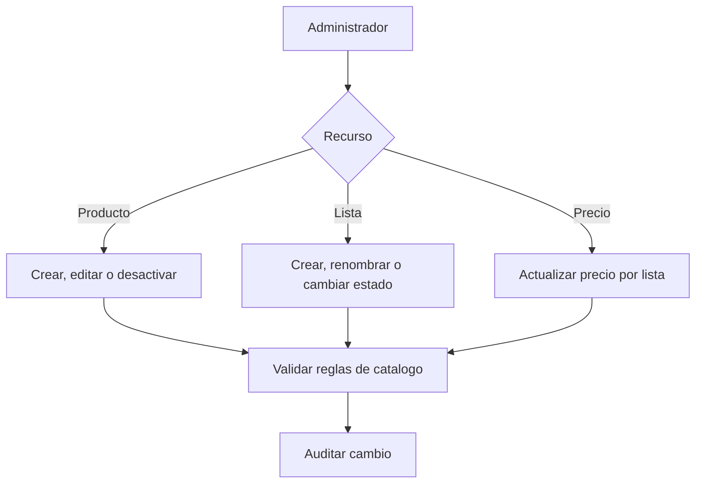

# Administracion de catalogo

```mermaid
flowchart TD
    A[Administrador] --> B{Recurso}
    B -->|Producto| C[Crear, editar o desactivar]
    B -->|Lista| D[Crear, renombrar o cambiar estado]
    B -->|Precio| E[Actualizar precio por lista]
    C --> F[Validar reglas de catalogo]
    D --> F
    E --> F
    F --> G[Auditar cambio]
```
