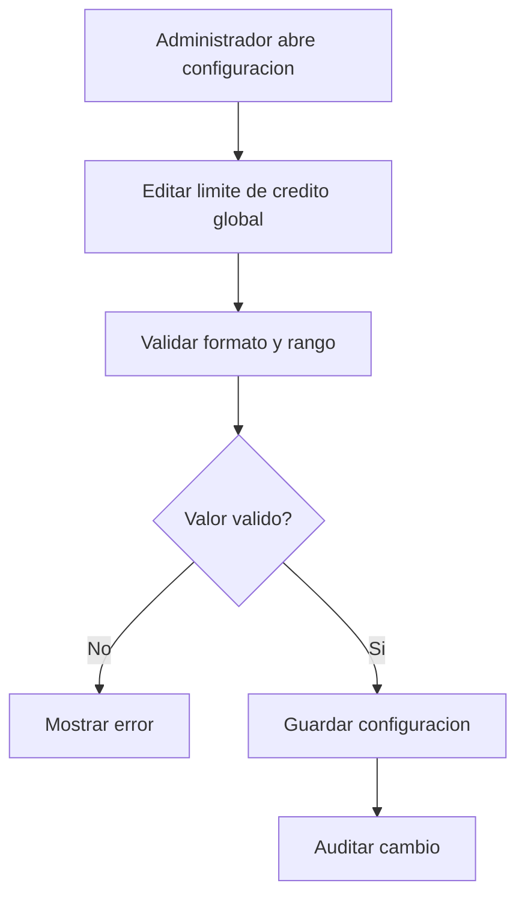

# Administracion de configuracion

```mermaid
flowchart TD
    A[Administrador abre configuracion] --> B[Editar limite de credito global]
    B --> C[Validar formato y rango]
    C --> D{Valor valido?}
    D -->|No| E[Mostrar error]
    D -->|Si| F[Guardar configuracion]
    F --> G[Auditar cambio]
```
