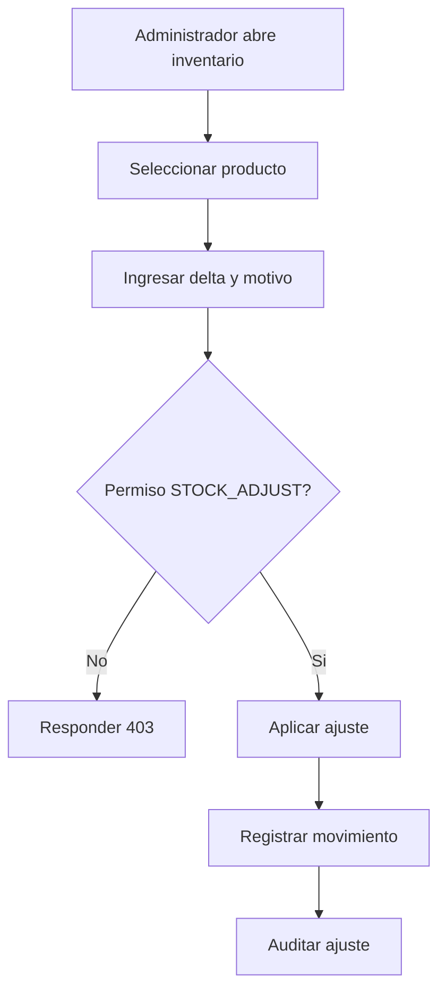

# Administracion de inventario

```mermaid
flowchart TD
    A[Administrador abre inventario] --> B[Seleccionar producto]
    B --> C[Ingresar delta y motivo]
    C --> D{Permiso STOCK_ADJUST?}
    D -->|No| E[Responder 403]
    D -->|Si| F[Aplicar ajuste]
    F --> G[Registrar movimiento]
    G --> H[Auditar ajuste]
```
