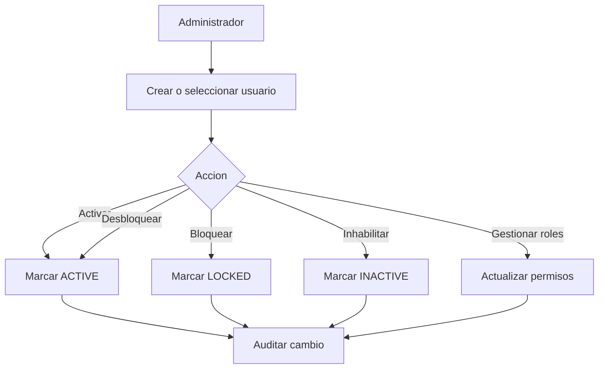

# Administracion de usuarios

```mermaid
flowchart TD
    A[Administrador] --> B[Crear o seleccionar usuario]
    B --> C{Accion}
    C -->|Activar| D[Marcar ACTIVE]
    C -->|Bloquear| E[Marcar LOCKED]
    C -->|Desbloquear| D
    C -->|Inhabilitar| F[Marcar INACTIVE]
    C -->|Gestionar roles| G[Actualizar permisos]
    D --> H[Auditar cambio]
    E --> H
    F --> H
    G --> H
```
