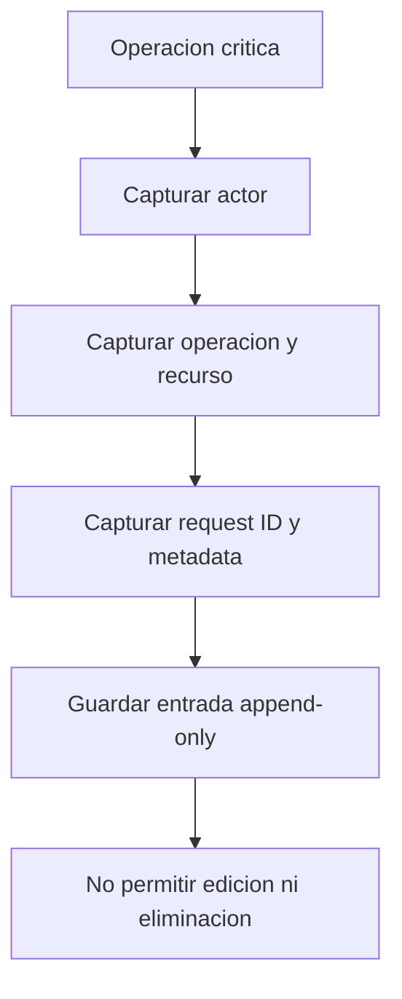

# Registro de evento de auditoria

```mermaid
flowchart TD
    A[Operacion critica] --> B[Capturar actor]
    B --> C[Capturar operacion y recurso]
    C --> D[Capturar request ID y metadata]
    D --> E[Guardar entrada append-only]
    E --> F[No permitir edicion ni eliminacion]
```
