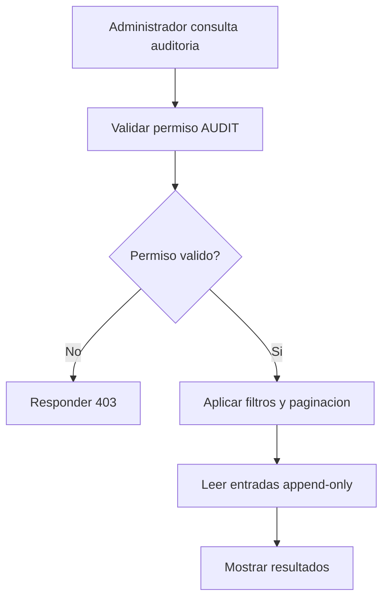

# Consulta de auditoria

```mermaid
flowchart TD
    A[Administrador consulta auditoria] --> B[Validar permiso AUDIT]
    B --> C{Permiso valido?}
    C -->|No| D[Responder 403]
    C -->|Si| E[Aplicar filtros y paginacion]
    E --> F[Leer entradas append-only]
    F --> G[Mostrar resultados]
```
