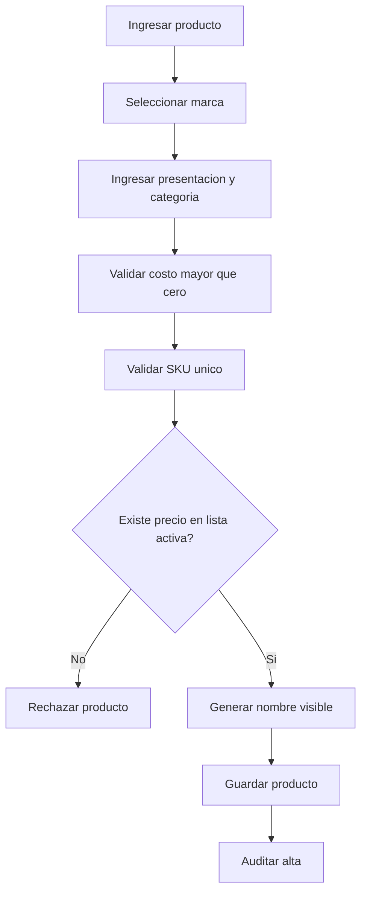

# Alta de producto

```mermaid
flowchart TD
    A[Ingresar producto] --> B[Seleccionar marca]
    B --> C[Ingresar presentacion y categoria]
    C --> D[Validar costo mayor que cero]
    D --> E[Validar SKU unico]
    E --> F{Existe precio en lista activa?}
    F -->|No| G[Rechazar producto]
    F -->|Si| H[Generar nombre visible]
    H --> I[Guardar producto]
    I --> J[Auditar alta]
```
