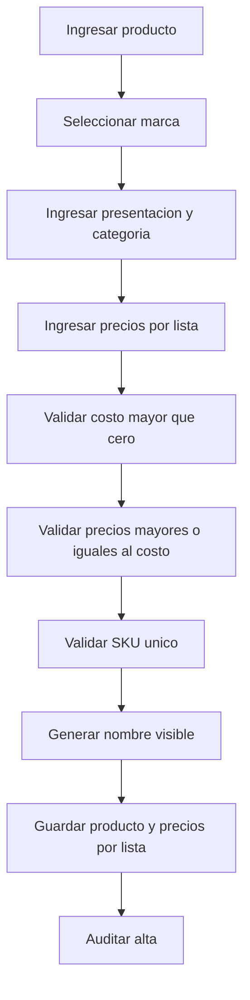

# Alta de producto

> La persistencia de precios por lista en el alta está implementada en backend; la adaptación del formulario en frontend está en desarrollo.

```mermaid
flowchart TD
    A[Ingresar producto] --> B[Seleccionar marca]
    B --> C[Ingresar presentacion y categoria]
    C --> D[Ingresar precios por lista]
    D --> E[Validar costo mayor que cero]
    E --> F[Validar precios mayores o iguales al costo]
    F --> G[Validar SKU unico]
    G --> H[Generar nombre visible]
    H --> I[Guardar producto y precios por lista]
    I --> J[Auditar alta]
```
