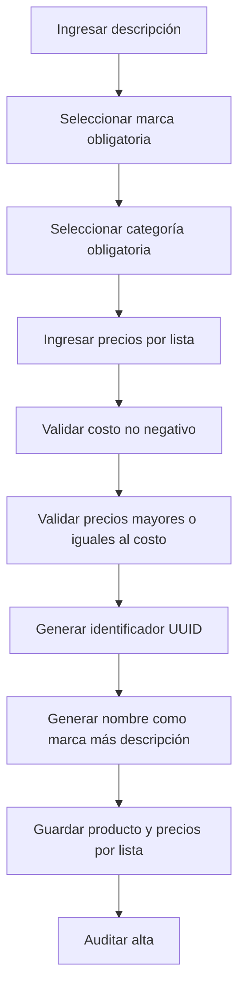

# Alta de producto

El formulario y la API requieren marca, categoría y descripción; generan el nombre automáticamente y guardan precios por lista.

```mermaid
flowchart TD
    A[Ingresar descripción] --> B[Seleccionar marca obligatoria]
    B --> C[Seleccionar categoría obligatoria]
    C --> D[Ingresar precios por lista]
    D --> E[Validar costo no negativo]
    E --> F[Validar precios mayores o iguales al costo]
    F --> G[Generar identificador UUID]
    G --> H[Generar nombre como marca más descripción]
    H --> I[Guardar producto y precios por lista]
    I --> J[Auditar alta]
```
