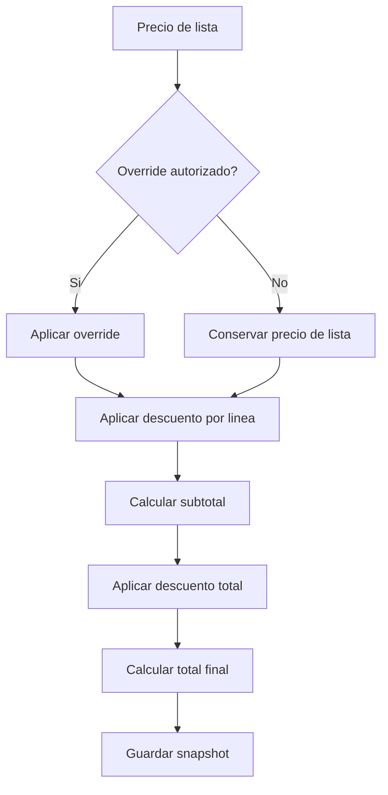

# Calculo de descuentos

```mermaid
flowchart TD
    A[Precio de lista] --> B{Override autorizado?}
    B -->|Si| C[Aplicar override]
    B -->|No| D[Conservar precio de lista]
    C --> E[Aplicar descuento por linea]
    D --> E
    E --> F[Calcular subtotal]
    F --> G[Aplicar descuento total]
    G --> H[Calcular total final]
    H --> I[Guardar snapshot]
```
