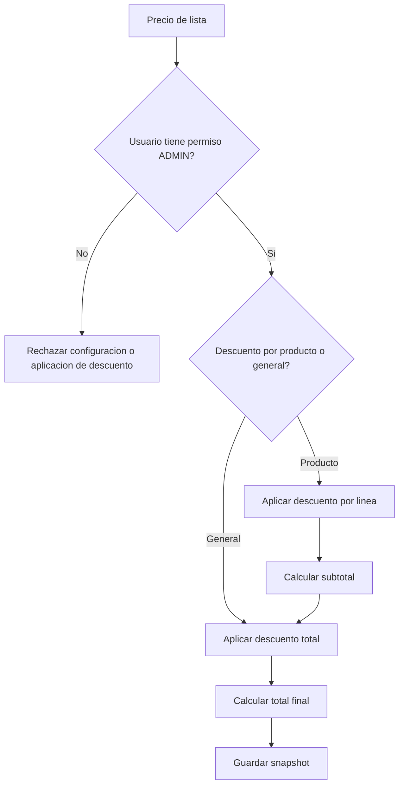

# Calculo de descuentos

> La configuracion o aplicacion de descuentos por producto o generales requiere autorizacion administrativa. Por el momento solo `ADMIN` puede realizarla.

```mermaid
flowchart TD
    A[Precio de lista] --> B{Usuario tiene permiso ADMIN?}
    B -->|No| C[Rechazar configuracion o aplicacion de descuento]
    B -->|Si| D{Descuento por producto o general?}
    D -->|Producto| E[Aplicar descuento por linea]
    D -->|General| F[Aplicar descuento total]
    E --> G[Calcular subtotal]
    G --> F
    F --> H[Calcular total final]
    H --> I[Guardar snapshot]
```
