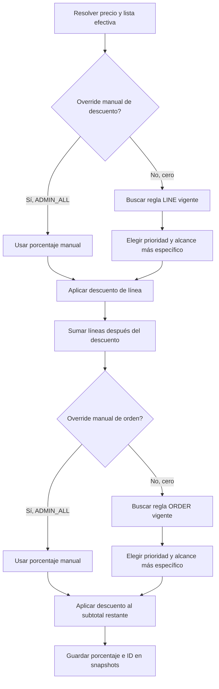

# Cálculo de descuentos comerciales

```mermaid
flowchart TD
    A[Resolver precio y lista efectiva] --> B{Override manual de descuento?}
    B -->|Sí, ADMIN_ALL| C[Usar porcentaje manual]
    B -->|No, cero| D[Buscar regla LINE vigente]
    D --> E[Elegir prioridad y alcance más específico]
    C --> F[Aplicar descuento de línea]
    E --> F
    F --> G[Sumar líneas después del descuento]
    G --> H{Override manual de orden?}
    H -->|Sí, ADMIN_ALL| I[Usar porcentaje manual]
    H -->|No, cero| J[Buscar regla ORDER vigente]
    J --> K[Elegir prioridad y alcance más específico]
    I --> L[Aplicar descuento al subtotal restante]
    K --> L
    L --> M[Guardar porcentaje e ID en snapshots]
```
