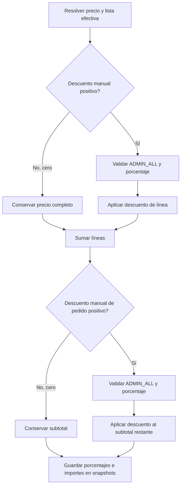

# Cálculo de descuentos manuales

> Enviar descuentos manuales requiere `ADMIN_ALL`. Solo se aplican los porcentajes explícitos durante la confirmación/edición del pedido; cero conserva el precio completo. V32 retira las reglas automáticas sin recalcular los importes históricos.

