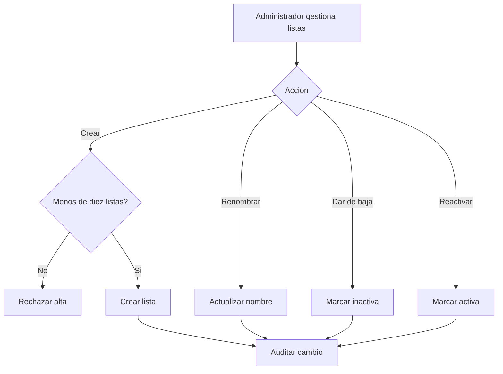

# Administracion de listas de precios

```mermaid
flowchart TD
    A[Administrador gestiona listas] --> B{Accion}
    B -->|Crear| C{Menos de diez listas?}
    C -->|No| D[Rechazar alta]
    C -->|Si| E[Crear lista]
    B -->|Renombrar| F[Actualizar nombre]
    B -->|Dar de baja| G[Marcar inactiva]
    B -->|Reactivar| H[Marcar activa]
    E --> I[Auditar cambio]
    F --> I
    G --> I
    H --> I
```
