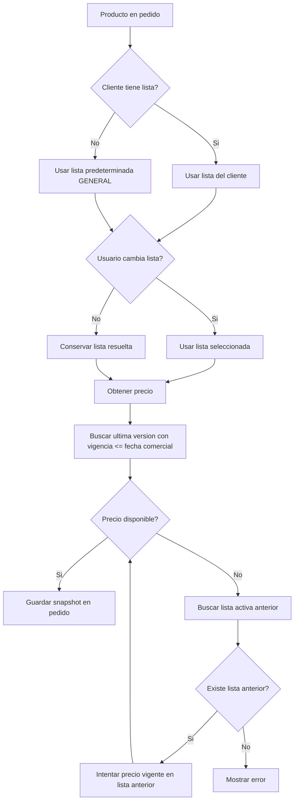

# Resolucion de precio

> Los precios se obtienen siempre desde una lista; el producto no guarda precios fuera de las listas.

```mermaid
flowchart TD
    A[Producto en pedido] --> B{Cliente tiene lista?}
    B -->|Si| C[Usar lista del cliente]
    B -->|No| D[Usar lista predeterminada GENERAL]
    C --> E{Usuario cambia lista?}
    D --> E
    E -->|Si| F[Usar lista seleccionada]
    E -->|No| G[Conservar lista resuelta]
    F --> H[Obtener precio]
    G --> H
    H --> I[Buscar ultima version con vigencia <= fecha comercial]
    I --> J{Precio disponible?}
    J -->|Si| K[Guardar snapshot en pedido]
    J -->|No| L[Buscar lista activa anterior]
    L --> M{Existe lista anterior?}
    M -->|Si| N[Intentar precio vigente en lista anterior]
    N --> J
    M -->|No| O[Mostrar error]
```
