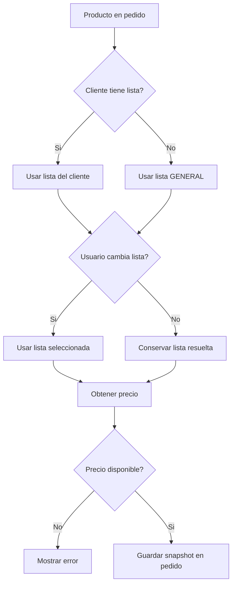

# Resolucion de precio

```mermaid
flowchart TD
    A[Producto en pedido] --> B{Cliente tiene lista?}
    B -->|Si| C[Usar lista del cliente]
    B -->|No| D[Usar lista GENERAL]
    C --> E{Usuario cambia lista?}
    D --> E
    E -->|Si| F[Usar lista seleccionada]
    E -->|No| G[Conservar lista resuelta]
    F --> H[Obtener precio]
    G --> H
    H --> I{Precio disponible?}
    I -->|No| J[Mostrar error]
    I -->|Si| K[Guardar snapshot en pedido]
```
