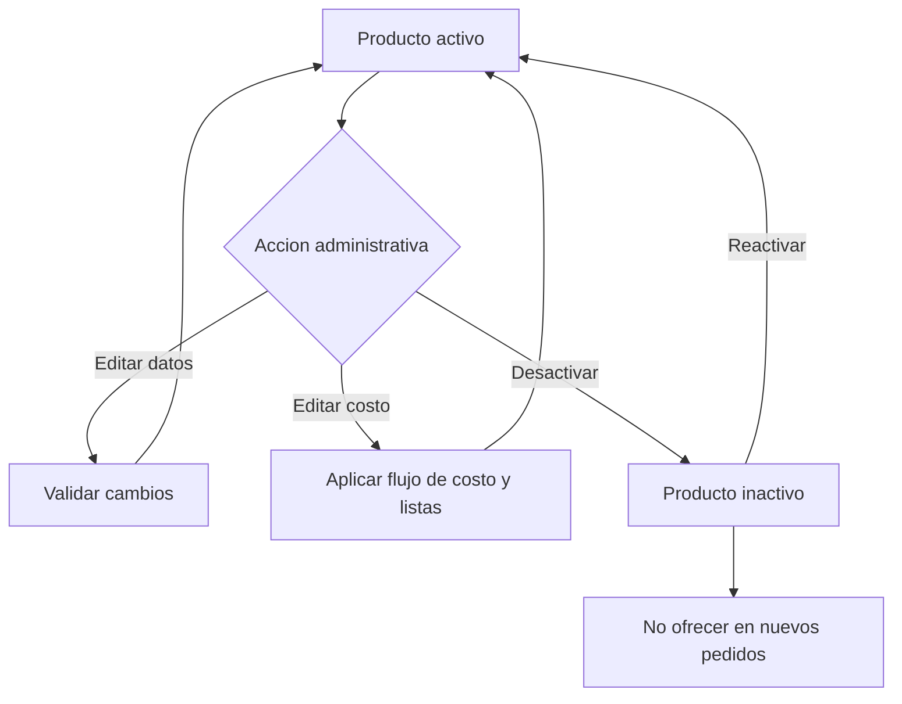

# Ciclo de vida del producto

> La edicion de costo con actualizacion obligatoria de listas esta pendiente de implementacion.

```mermaid
flowchart TD
    A[Producto activo] --> B{Accion administrativa}
    B -->|Editar datos| C[Validar cambios]
    C --> A
    B -->|Editar costo| F[Aplicar flujo de costo y listas]
    F --> A
    B -->|Desactivar| D[Producto inactivo]
    D -->|Reactivar| A
    D --> E[No ofrecer en nuevos pedidos]
```
