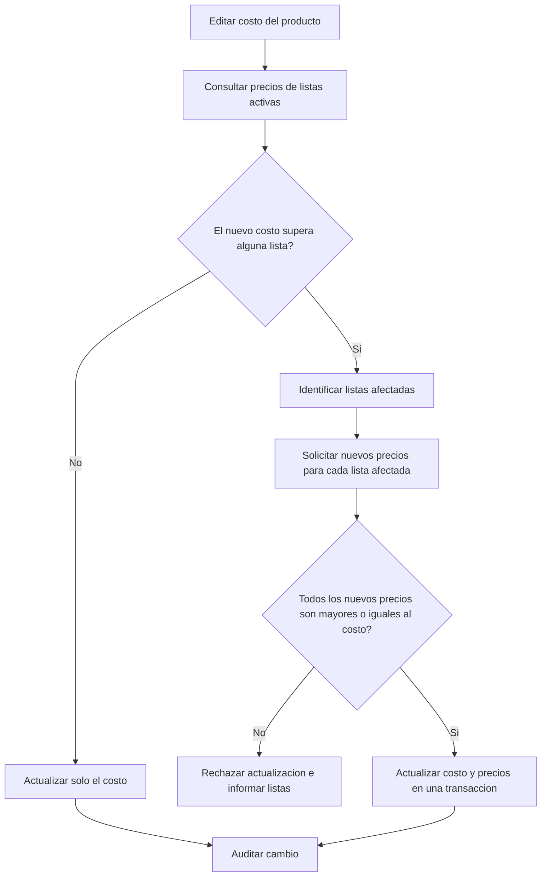

# Actualizacion de costo y precios por lista

> Regla de negocio implementada y verificada en el backend; la adaptación del formulario en el frontend para mostrar listas afectadas está en desarrollo.

