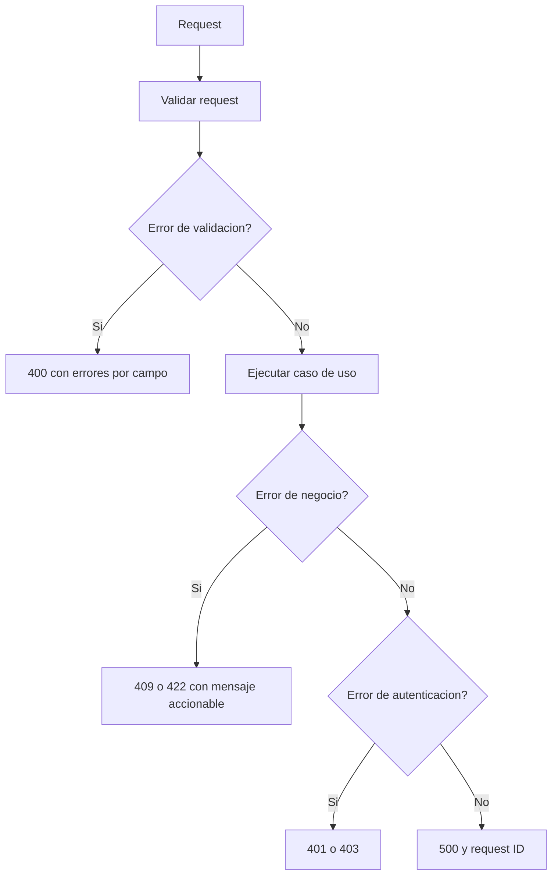

# Manejo de errores

```mermaid
flowchart TD
    A[Request] --> B[Validar request]
    B --> C{Error de validacion?}
    C -->|Si| D[400 con errores por campo]
    C -->|No| E[Ejecutar caso de uso]
    E --> F{Error de negocio?}
    F -->|Si| G[409 o 422 con mensaje accionable]
    F -->|No| H{Error de autenticacion?}
    H -->|Si| I[401 o 403]
    H -->|No| J[500 y request ID]
```
