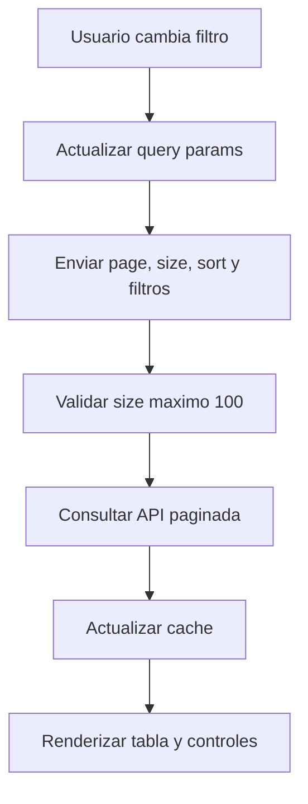

# Paginacion y filtros

```mermaid
flowchart TD
    A[Usuario cambia filtro] --> B[Actualizar query params]
    B --> C[Enviar page, size, sort y filtros]
    C --> D[Validar size maximo 100]
    D --> E[Consultar API paginada]
    E --> F[Actualizar cache]
    F --> G[Renderizar tabla y controles]
```
