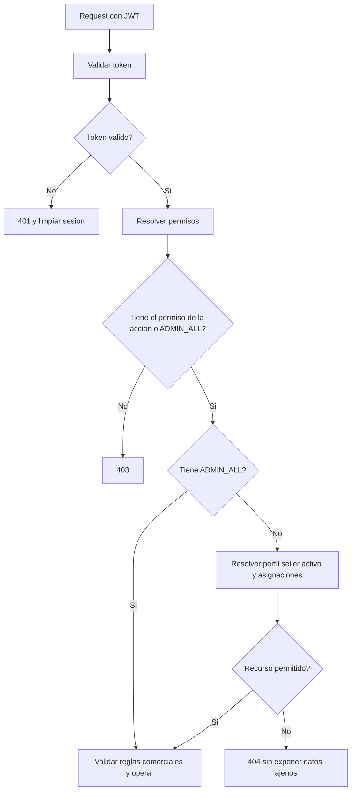

# Autorizacion y ownership

```mermaid
flowchart TD
    A[Request con JWT] --> B[Validar token]
    B --> C{Token valido?}
    C -->|No| D[401 y limpiar sesion]
    C -->|Si| E[Resolver permisos]
    E --> F{Tiene el permiso de la accion o ADMIN_ALL?}
    F -->|No| H[403]
    F -->|Si| G{Tiene ADMIN_ALL?}
    G -->|Si| I[Validar reglas comerciales y operar]
    G -->|No| J[Resolver perfil seller activo y asignaciones]
    J --> K{Recurso permitido?}
    K -->|No| L[404 sin exponer datos ajenos]
    K -->|Si| I
```

Pedidos y ventas separan permiso y alcance. Las áreas todavía no migradas y la
revisión administrativa conservan sus restricciones a ADMIN_ALL.
