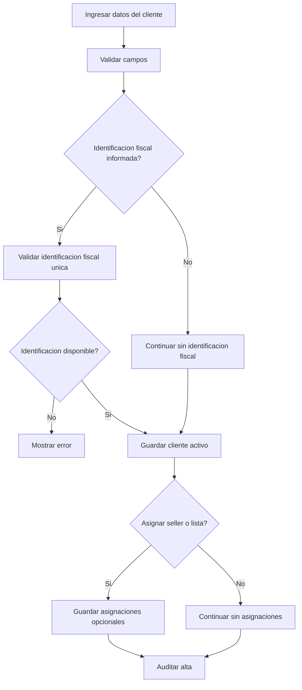

# Alta de cliente

```mermaid
flowchart TD
    A[Ingresar datos del cliente] --> B[Validar campos]
    B --> C{Identificacion fiscal informada?}
    C -->|Si| D[Validar identificacion fiscal unica]
    C -->|No| E[Continuar sin identificacion fiscal]
    D --> F{Identificacion disponible?}
    F -->|No| G[Mostrar error]
    F -->|Si| H[Guardar cliente activo]
    E --> H
    H --> I{Asignar seller o lista?}
    I -->|Si| J[Guardar asignaciones opcionales]
    I -->|No| K[Continuar sin asignaciones]
    J --> L[Auditar alta]
    K --> L
```
