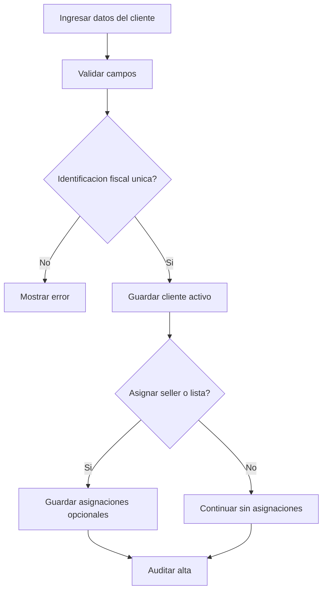

# Alta de cliente

```mermaid
flowchart TD
    A[Ingresar datos del cliente] --> B[Validar campos]
    B --> C{Identificacion fiscal unica?}
    C -->|No| D[Mostrar error]
    C -->|Si| E[Guardar cliente activo]
    E --> F{Asignar seller o lista?}
    F -->|Si| G[Guardar asignaciones opcionales]
    F -->|No| H[Continuar sin asignaciones]
    G --> I[Auditar alta]
    H --> I
```
