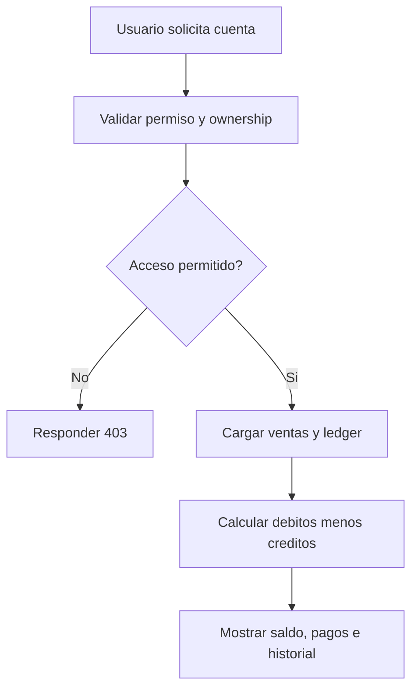

# Consulta de cuenta corriente

```mermaid
flowchart TD
    A[Usuario solicita cuenta] --> B[Validar permiso y ownership]
    B --> C{Acceso permitido?}
    C -->|No| D[Responder 403]
    C -->|Si| E[Cargar ventas y ledger]
    E --> F[Calcular debitos menos creditos]
    F --> G[Mostrar saldo, pagos e historial]
```
