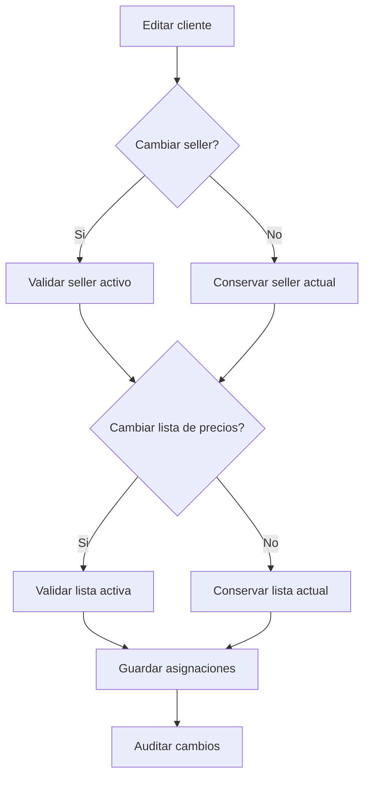

# Asignaciones comerciales del cliente

```mermaid
flowchart TD
    A[Editar cliente] --> B{Cambiar seller?}
    B -->|Si| C[Validar seller activo]
    B -->|No| D[Conservar seller actual]
    C --> E{Cambiar lista de precios?}
    D --> E
    E -->|Si| F[Validar lista activa]
    E -->|No| G[Conservar lista actual]
    F --> H[Guardar asignaciones]
    G --> H
    H --> I[Auditar cambios]
```
