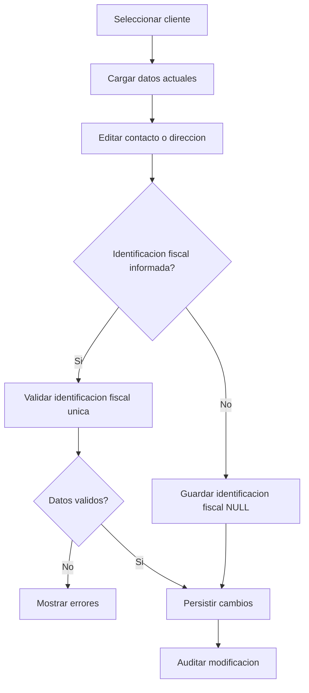

# Modificacion de cliente

```mermaid
flowchart TD
    A[Seleccionar cliente] --> B[Cargar datos actuales]
    B --> C[Editar contacto o direccion]
    C --> D{Identificacion fiscal informada?}
    D -->|Si| E[Validar identificacion fiscal unica]
    D -->|No| F[Guardar identificacion fiscal NULL]
    E --> G{Datos validos?}
    G -->|No| H[Mostrar errores]
    G -->|Si| I[Persistir cambios]
    F --> I
    I --> J[Auditar modificacion]
```
