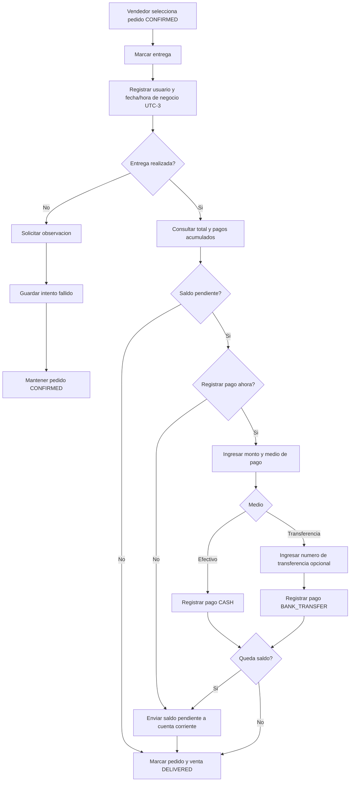

# Intento de entrega

```mermaid
flowchart TD
    A[Vendedor selecciona pedido CONFIRMED] --> B[Marcar entrega]
    B --> C[Registrar usuario y fecha/hora de negocio UTC-3]
    C --> D{Entrega realizada?}
    D -->|No| E[Solicitar observacion]
    E --> F[Guardar intento fallido]
    F --> G[Mantener pedido CONFIRMED]
    D -->|Si| H[Consultar total y pagos acumulados]
    H --> I{Saldo pendiente?}
    I -->|No| J[Marcar pedido y venta DELIVERED]
    I -->|Si| K{Registrar pago ahora?}
    K -->|No| L[Enviar saldo pendiente a cuenta corriente]
    K -->|Si| M[Ingresar monto y medio de pago]
    M --> N{Medio}
    N -->|Efectivo| O[Registrar pago CASH]
    N -->|Transferencia| P[Ingresar numero de transferencia opcional]
    P --> Q1[Registrar pago BANK_TRANSFER]
    O --> Q{Queda saldo?}
    Q1 --> Q
    Q -->|Si| L
    Q -->|No| J
    L --> J
```
