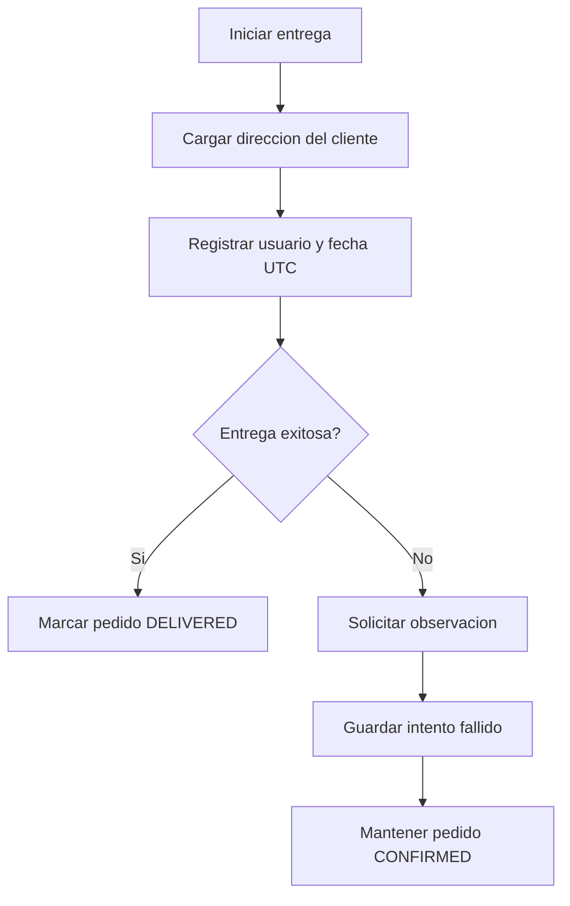

# Intento de entrega

```mermaid
flowchart TD
    A[Iniciar entrega] --> B[Cargar direccion del cliente]
    B --> C[Registrar usuario y fecha UTC]
    C --> D{Entrega exitosa?}
    D -->|Si| E[Marcar pedido DELIVERED]
    D -->|No| F[Solicitar observacion]
    F --> G[Guardar intento fallido]
    G --> H[Mantener pedido CONFIRMED]
```
