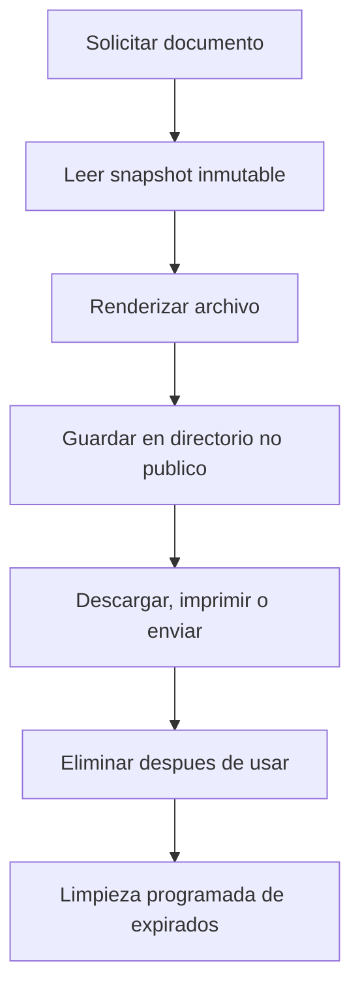

# Ciclo de vida del archivo temporal

```mermaid
flowchart TD
    A[Solicitar documento] --> B[Leer snapshot inmutable]
    B --> C[Renderizar archivo]
    C --> D[Guardar en directorio no publico]
    D --> E[Descargar, imprimir o enviar]
    E --> F[Eliminar despues de usar]
    F --> G[Limpieza programada de expirados]
```
