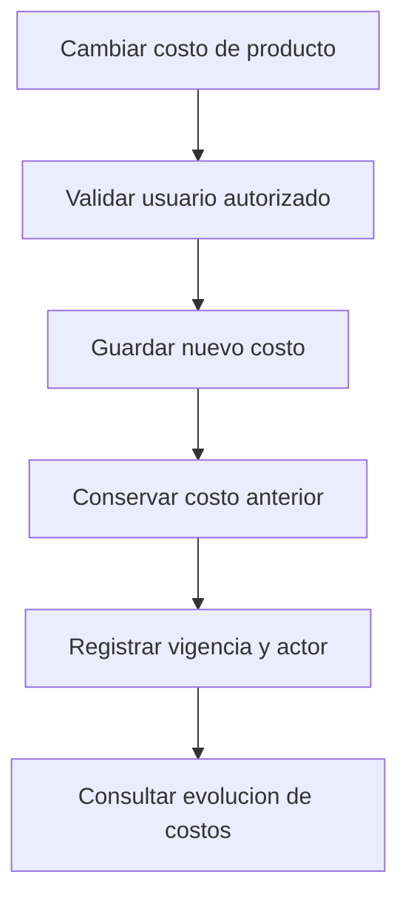

# Historial de costos futuro

```mermaid
flowchart TD
    A[Cambiar costo de producto] --> B[Validar usuario autorizado]
    B --> C[Guardar nuevo costo]
    C --> D[Conservar costo anterior]
    D --> E[Registrar vigencia y actor]
    E --> F[Consultar evolucion de costos]
```
