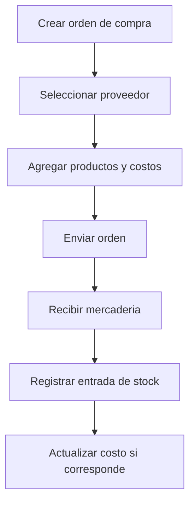

# Proveedores y compras futuro

```mermaid
flowchart TD
    A[Crear orden de compra] --> B[Seleccionar proveedor]
    B --> C[Agregar productos y costos]
    C --> D[Enviar orden]
    D --> E[Recibir mercaderia]
    E --> F[Registrar entrada de stock]
    F --> G[Actualizar costo si corresponde]
```
