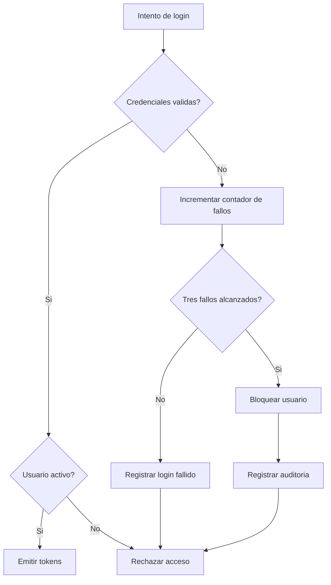

# Bloqueo por intentos fallidos

```mermaid
flowchart TD
    A[Intento de login] --> B{Credenciales validas?}
    B -->|Si| C{Usuario activo?}
    C -->|Si| D[Emitir tokens]
    C -->|No| E[Rechazar acceso]
    B -->|No| F[Incrementar contador de fallos]
    F --> G{Tres fallos alcanzados?}
    G -->|No| H[Registrar login fallido]
    G -->|Si| I[Bloquear usuario]
    I --> J[Registrar auditoria]
    H --> E
    J --> E
```
