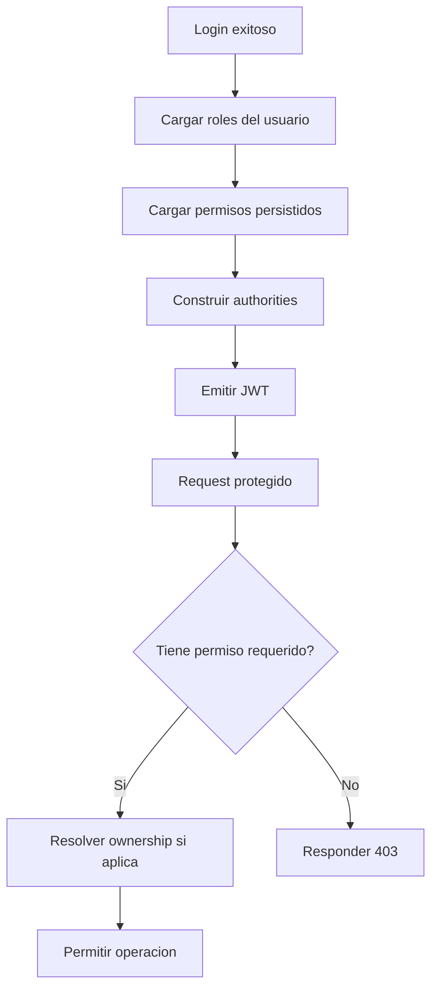

# Resolucion de roles y permisos

```mermaid
flowchart TD
    A[Login exitoso] --> B[Cargar roles del usuario]
    B --> C[Cargar permisos persistidos]
    C --> D[Construir authorities]
    D --> E[Emitir JWT]
    E --> F[Request protegido]
    F --> G{Tiene permiso requerido?}
    G -->|Si| H[Resolver ownership si aplica]
    H --> I[Permitir operacion]
    G -->|No| J[Responder 403]
```
