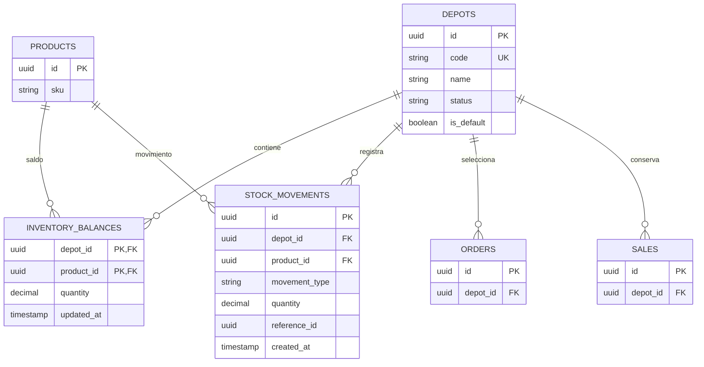

# Modelo de inventario multi-depósito

`inventory_balances` usa clave primaria compuesta `(depot_id, product_id)`. Los
movimientos son append-only. V23 asigna balances, movimientos, pedidos y ventas
preexistentes al depósito `CENTRAL`.
