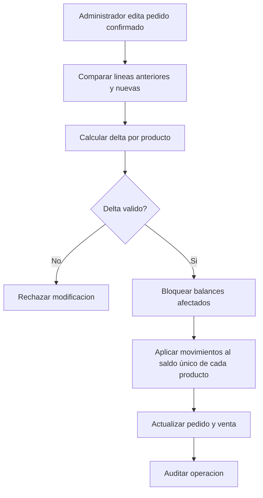

# Delta de stock por edicion de pedido

```mermaid
flowchart TD
    A[Administrador edita pedido confirmado] --> B[Comparar lineas anteriores y nuevas]
    B --> C[Calcular delta por producto]
    C --> D{Delta valido?}
    D -->|No| E[Rechazar modificacion]
    D -->|Si| F[Bloquear balances afectados]
    F --> G[Aplicar movimientos al saldo único de cada producto]
    G --> H[Actualizar pedido y venta]
    H --> I[Auditar operacion]
```
