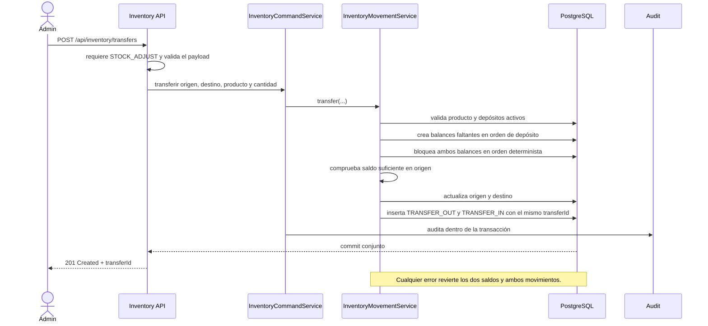

# Transferencia entre depósitos

Los ajustes pueden dejar un saldo negativo según el comportamiento de inventario
existente; una transferencia, en cambio, no puede retirar más de lo disponible
en el depósito de origen. Una devolución o cancelación repone el depósito
asociado al movimiento comercial original.
