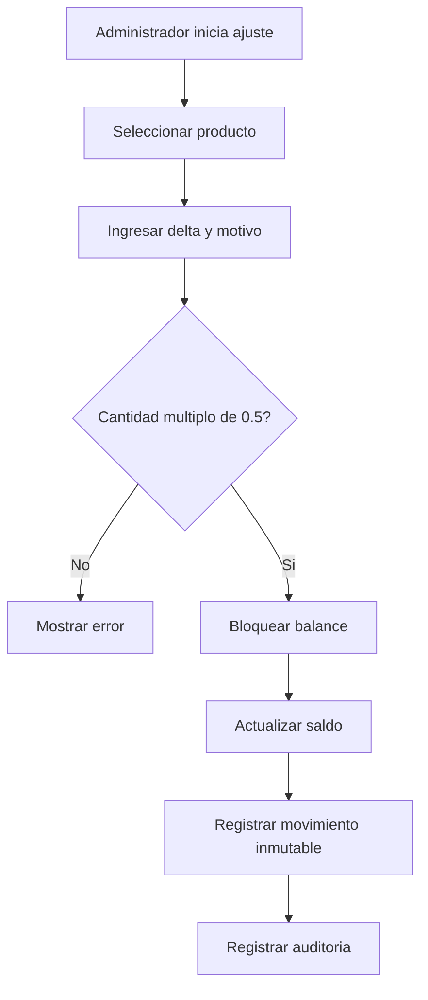

# Ajuste manual de stock

```mermaid
flowchart TD
    A[Administrador inicia ajuste] --> B[Seleccionar producto]
    B --> C[Ingresar delta y motivo]
    C --> D{Cantidad multiplo de 0.5?}
    D -->|No| E[Mostrar error]
    D -->|Si| F[Bloquear balance]
    F --> G[Actualizar saldo]
    G --> H[Registrar movimiento inmutable]
    H --> I[Registrar auditoria]
```
