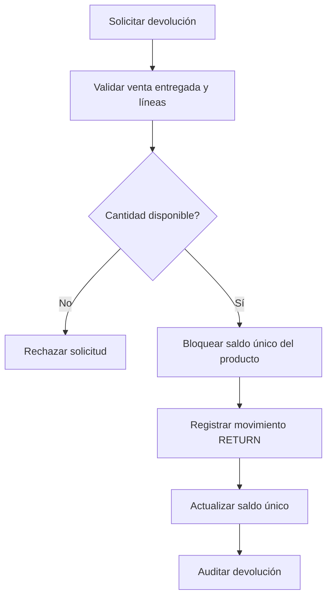

# Devolucion de stock

```mermaid
flowchart TD
    A[Solicitar devolución] --> B[Validar venta entregada y líneas]
    B --> C{Cantidad disponible?}
    C -->|No| D[Rechazar solicitud]
    C -->|Sí| E[Bloquear saldo único del producto]
    E --> F[Registrar movimiento RETURN]
    F --> G[Actualizar saldo único]
    G --> H[Auditar devolución]
```
