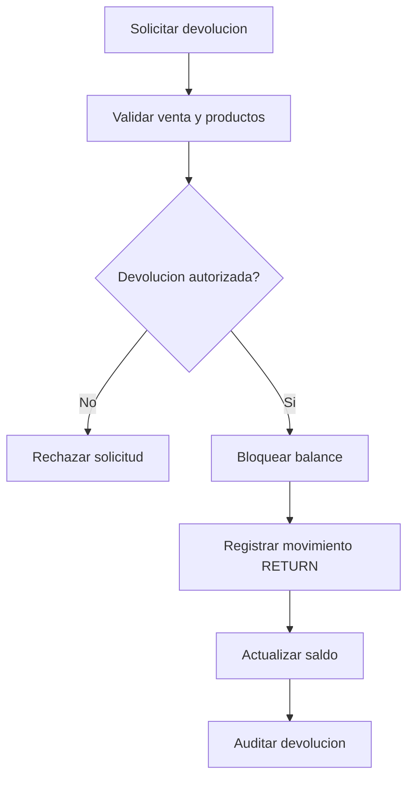

# Devolucion de stock

```mermaid
flowchart TD
    A[Solicitar devolucion] --> B[Validar venta y productos]
    B --> C{Devolucion autorizada?}
    C -->|No| D[Rechazar solicitud]
    C -->|Si| E[Bloquear balance]
    E --> F[Registrar movimiento RETURN]
    F --> G[Actualizar saldo]
    G --> H[Auditar devolucion]
```
