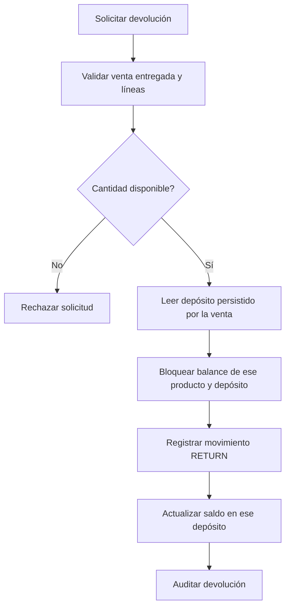

# Devolucion de stock

```mermaid
flowchart TD
    A[Solicitar devolución] --> B[Validar venta entregada y líneas]
    B --> C{Cantidad disponible?}
    C -->|No| D[Rechazar solicitud]
    C -->|Sí| E[Leer depósito persistido por la venta]
    E --> F[Bloquear balance de ese producto y depósito]
    F --> G[Registrar movimiento RETURN]
    G --> H[Actualizar saldo en ese depósito]
    H --> I[Auditar devolución]
```
