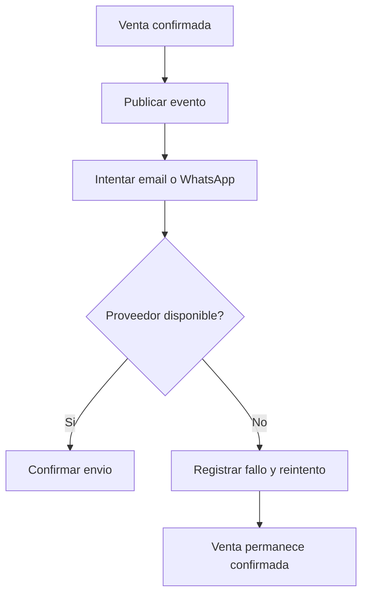

# Fallo de proveedor externo

```mermaid
flowchart TD
    A[Venta confirmada] --> B[Publicar evento]
    B --> C[Intentar email o WhatsApp]
    C --> D{Proveedor disponible?}
    D -->|Si| E[Confirmar envio]
    D -->|No| F[Registrar fallo y reintento]
    F --> G[Venta permanece confirmada]
```
