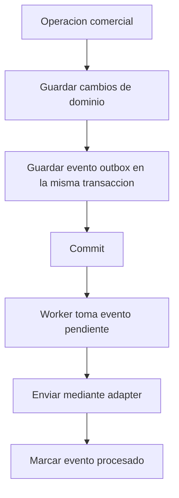

# Outbox de notificaciones

```mermaid
flowchart TD
    A[Operacion comercial] --> B[Guardar cambios de dominio]
    B --> C[Guardar evento outbox en la misma transaccion]
    C --> D[Commit]
    D --> E[Worker toma evento pendiente]
    E --> F[Enviar mediante adapter]
    F --> G[Marcar evento procesado]
```
