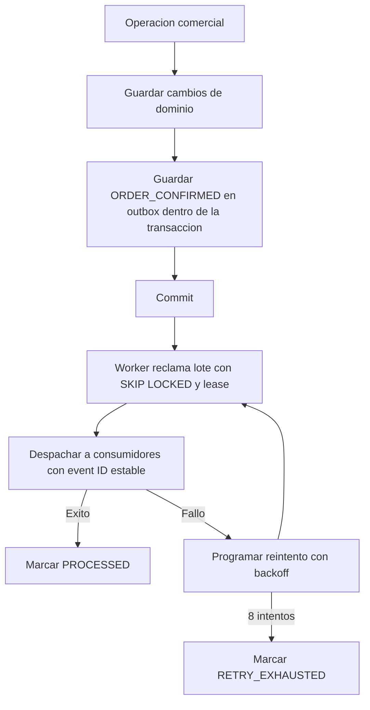

# Outbox de notificaciones

El despacho es al menos una vez. Los consumidores deduplican usando el ID del
evento. La integración de canales externos se agrega en la tarea de tickets y
notificaciones.
