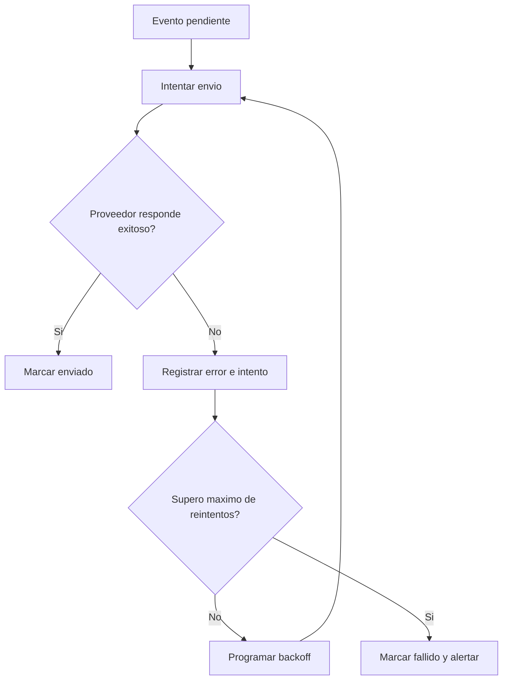

# Reintento de notificacion

```mermaid
flowchart TD
    A[Evento pendiente] --> B[Intentar envio]
    B --> C{Proveedor responde exitoso?}
    C -->|Si| D[Marcar enviado]
    C -->|No| E[Registrar error e intento]
    E --> F{Supero maximo de reintentos?}
    F -->|No| G[Programar backoff]
    F -->|Si| H[Marcar fallido y alertar]
    G --> B
```
